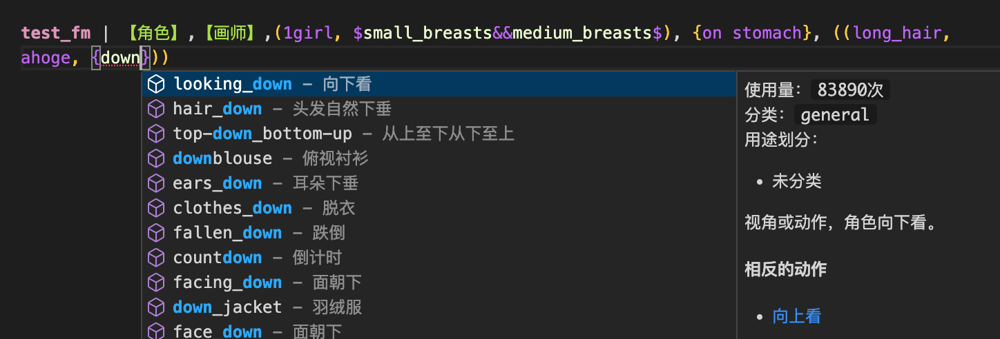

# Danbooru词条自动补全与全局提示检索


---

> 请注意，本插件仅会对*.prompts文件进行词条补全，其他文件类型不支持

提供词库导入，词条自动补全，全局提示检索；同时支持多种随机Prompt构造模式【需生成端支持】

## 特性

支持词库导入展示，全词条补全，prompt构造解析，异常构造提示，无效prompt提示

## 词库构造

词库需传入json文件，词库格式如下：
```json
[
  {
    "n": "<tag名>",
    "z": "<tag中文名，可为空>",
    "w": "<tag的Wiki，支持markdown格式，自动显示在右侧，可为空>",
    "o": "别名：`<别名1>`、`<别名2>`...",
    "c": ["<分类名1>","<分类名2>"],
    "r": 0 // 压缩的信息数字，压缩方式为 r=post_count*16 + (is_deleted? 8 : 0) + category(0=general 1=artist 3=copyright 4=character)
  },
  // ...
]
```

## 从源代码构建

> 假定你已经了解并安装了nodejs、vsce。

```bash
# 1. 项目克隆
git clone https://github.com/fexli/vscode-nai-tag-auto-compile.git
cd vscode-nai-tag-auto-compile
# 2. 安装依赖
npm i
# 3. 进行构建
vsce package --allow-missing-repository
```

将构建完成的vsix安装到VSCode扩展，配置好词库文件，重启VSCode即可开始使用。

## 设置解释


> 本插件会向VSC设置中添加四个设置：

### tags.tagsFile

词库文件绝对路径，默认为空（为空时不加载，不会进行补全）

词库构造方式按照[词库构造](#词库构造)进行构造

### tags.promptsRootPath

prompts文件夹绝对路径，默认为空（为空时不进行prompt构造解析）

### tags.lintInFile

是否在prompt文件内显示tag中文提示，默认为true（看着吵闹或者不需要可以关闭）

### tags.lintColor

当启用lintInFile时，用于显示tag中文提示的颜色，推荐使用：
```white;width: 1000px; height: 3px; position: absolute;```

**Enjoy!**
